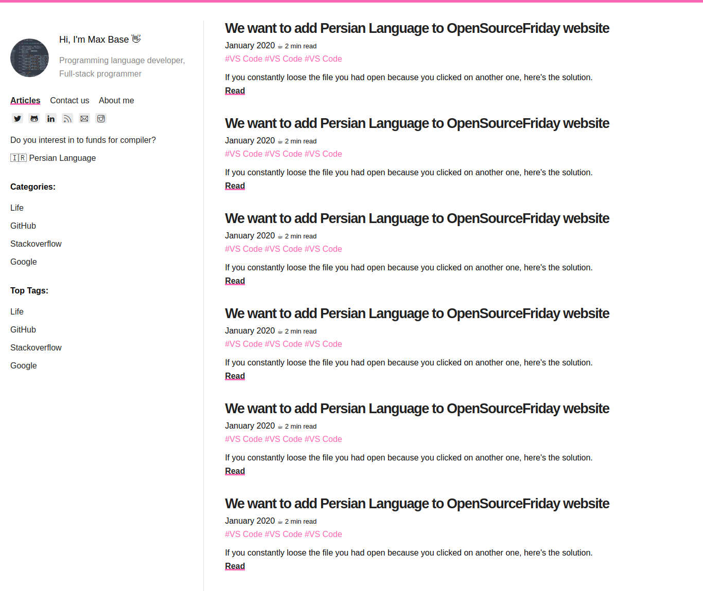
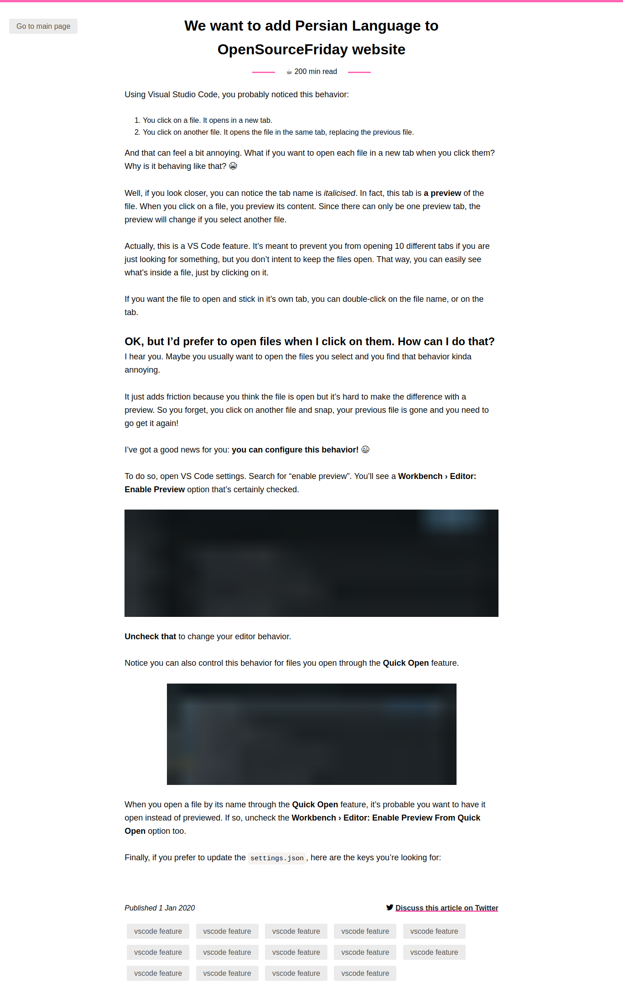

# MoloxBlog

MoloxBlog is a free blog template for personal using...

## Molox Blog

### Features

- Pure css, html code by me (Max Base)
- UI/UX of pages followed by **Nicolas Carlo** work (design)
- Icon web pack [themify](https://themify.me/themify-icons)

To thanks from [Nicolas Carlo](https://www.github.com/nicoespeon), I set **MIT** [license](LICENSE) for this project.

---------

# Max Base

My nickname is Max, Programming language developer, Full-stack programmer. I love computer scientists, researchers, and compilers.

## Asrez Team

A team includes some programmer, developer, designer, researcher(s) especially Max Base.

[Asrez Team](https://www.asrez.com/)
